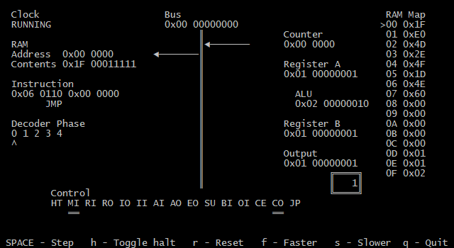

Simple VM
=========

This is a very simple implementation of a computer with the SAP-1 (Simple As Possible) architecture from*Digital Computer Electronics* by Albert Paul Malvino.

The direct influence was of course [Ben Eater](http://eater.net)'s excellent [youtube series](https://www.youtube.com/watch?v=HyznrdDSSGM&list=PLowKtXNTBypGqImE405J2565dvjafglHU) building this 8-bit computer on breadboards.

I started this project for two reasons. Firstly, I didn't want to foot the bill for all those breadboards. Secondly, I wanted to learn the C progrmmaing language and the Windows Console API.

Capabilities
------------
The computer currently has 9 machine instructions defined by Ben. These are `NOP`, `LDA`, `ADD`, `SUB`, `STA`, `LDI`, `JMP`, `OPT` and `HLT`. (`OPT` should really be `OUT` but for compiler reasons I had to use a different macro name.)

Currently pre-compiled into the binary are three sample programs:
* 14 + 28
* Multiples of 3
* Fibonacci Generator

Preview
-------
Here's a screenshot demonstrating the program running.



The computer can be controlled via the keyboard and can be made to step through micro-instructions one-by-one.

Usage
-----

```
vm [program_file]
```

The VM can run a binary file of machine instructions provided on the command line. See http://github.com/IJMacD/simple-assembler for an assembler to create the binary file.

If a program file is not provided the three built-in programs can be switched with the number keys.

Components
----------

* A Register
* B Register
* Clock
* Instruction Register
* Program Counter
* RAM
    * Address
    * Contents
* ALU
* Output
* Bus Indicator
* Control
* Microcode EEPROM
